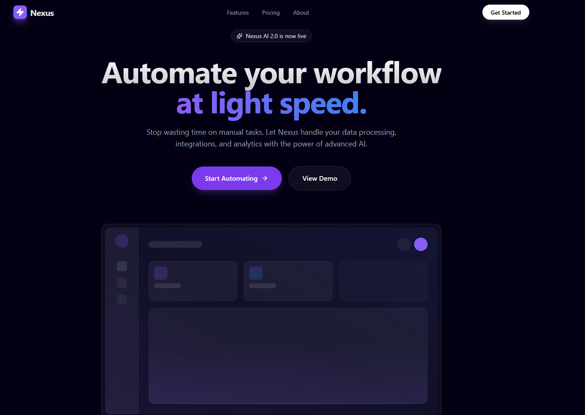

# ⚡ Nexus AI - Modern SaaS Landing Page

A high-conversion landing page for a fictional AI SaaS product. Built to demonstrate advanced frontend techniques including scroll-triggered animations, complex layouts (Bento Grid), and glassmorphism UI.

## 🚀 Live Demo
[View Live Project](https://saas-landing-page-rose-zeta.vercel.app/)

## ✨ Key Features
* **🎭 Scroll Reveal Animations:** Elements fade in and slide up elegantly as the user scrolls (`Framer Motion`).
* **🍱 Bento Grid Layout:** Asymmetric, Apple-style grid layout that adapts perfectly to all screen sizes.
* **💎 Glassmorphism Navbar:** Smart sticky header that becomes blurred/glassy when scrolling.
* **🎨 Modern UI Design:** Deep dark mode with vibrant neon accents and "glow" effects.
* **📱 Fully Responsive:** Optimized for mobile, tablet, and desktop.

## 🛠️ Tech Stack
* React + Vite
* Tailwind CSS (Styling & Gradients)
* Framer Motion (Complex Animations)
* Lucide React (Iconography)

---
Made with ❤️ by [Carlos Gordillo](https://github.com/c26200)
